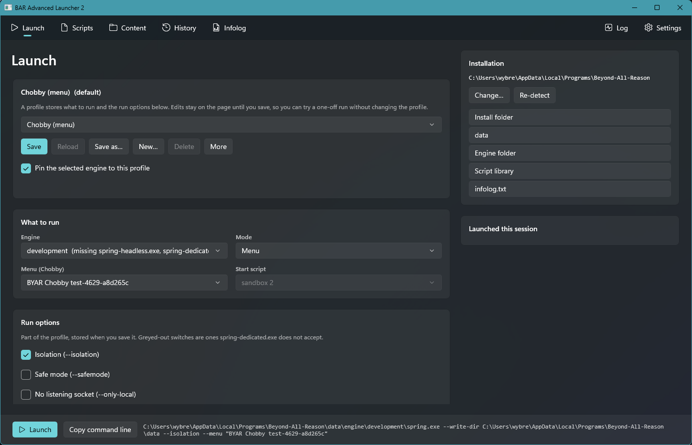
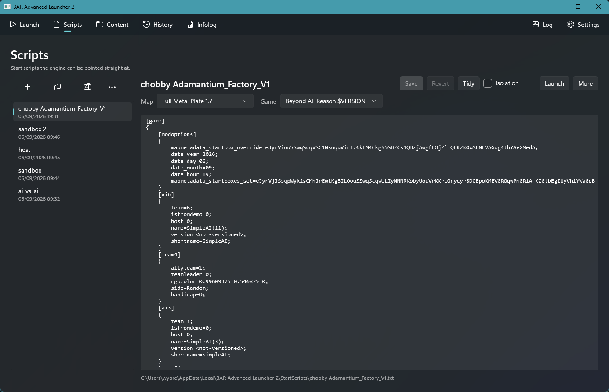
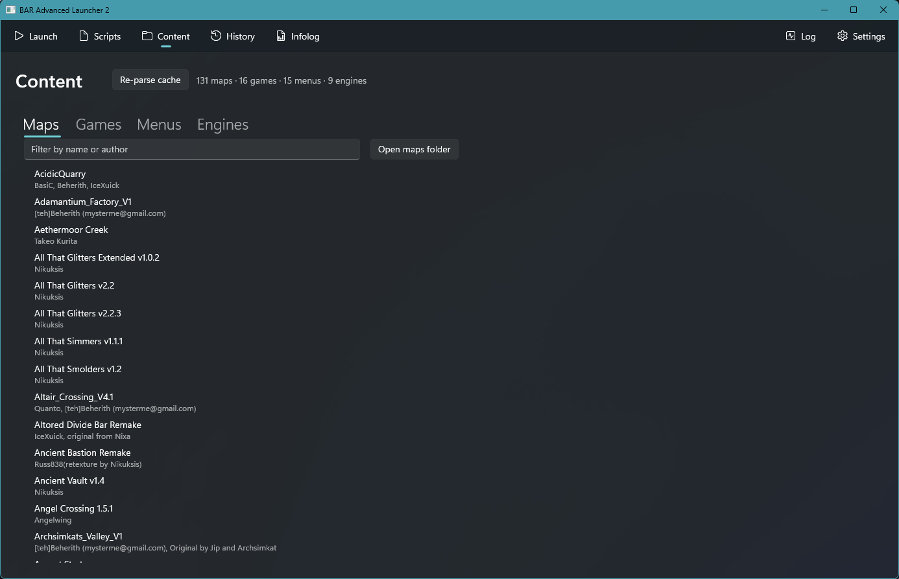
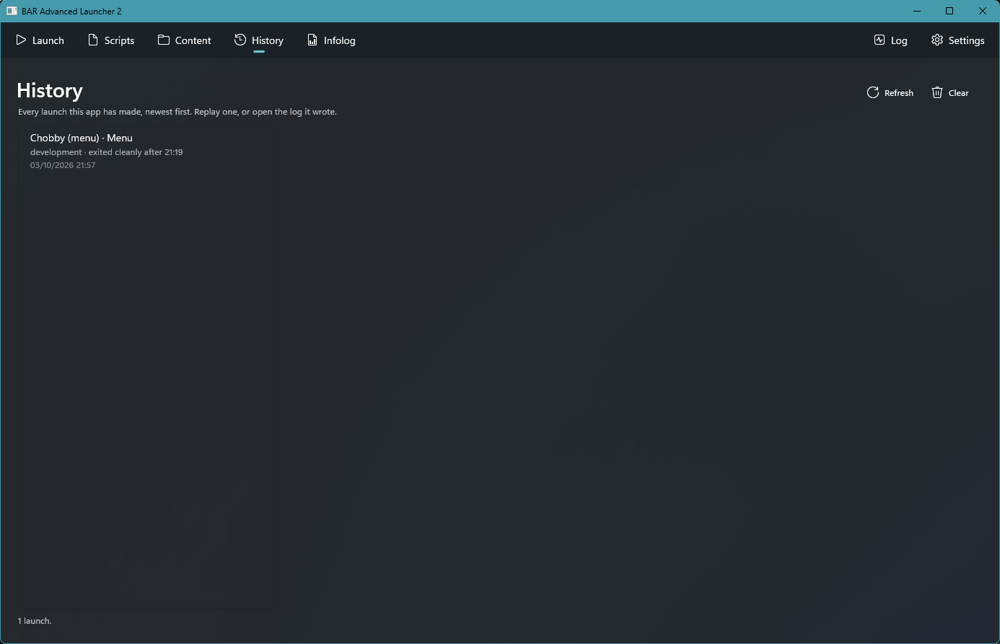
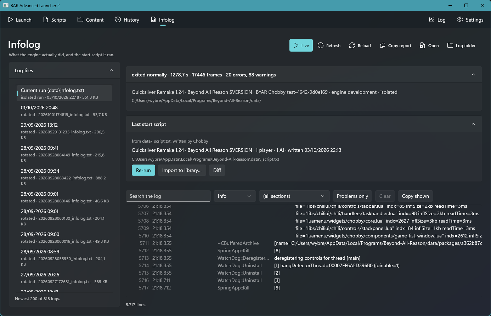
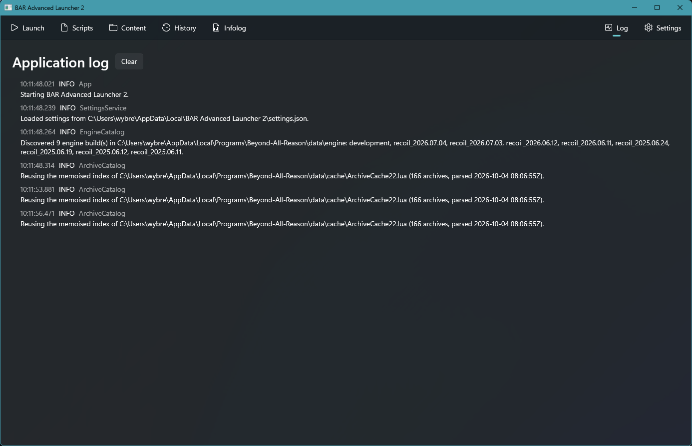

# BAR Advanced Launcher 2

A developer-focused launcher for [Beyond All Reason](https://www.beyondallreason.info/) and the
[Recoil](https://github.com/beyond-all-reason/RecoilEngine) engine, built with WinUI 3.

Point it at a BAR install and it shows every engine, game, map and menu that install contains.
You can launch any combination of them, keep a library of start scripts, and read the engine's
`infolog.txt` without leaving the app.

## Features

- **Launch profiles.** Save what to run (engine, mode, menu or start script) together with the
  engine's run options. The exact command line is shown, and you can copy it.
- **Start script library.** Create, edit, duplicate, tidy and launch `script.txt` files.
- **Content browser.** Browse the maps, games, menus and engines found in the install.
- **Launch history.** Every launch the app made, with how it ended. Replay one or open its log.
- **Infolog viewer.** Search and filter the engine log, follow it live, and recover the last start
  script the engine ran.
- **Multiple engines side by side.** Pin an engine to a profile, including development builds.

## Install

Download the zip for your platform (`win-x64`, `win-x86` or `win-arm64`) from the
[Releases](../../releases) page, extract it anywhere and run `BAR Advanced Launcher 2.exe`. The app
is self-contained and unpackaged, so it needs no installer.

On first start it looks for BAR in `%LOCALAPPDATA%\Programs\Beyond-All-Reason`. If yours lives
elsewhere, use **Change…** on the Launch page.

## Tour

### Launch

Pick a profile, choose the engine and mode, set run options and launch. Shortcuts open the install,
data, engine and script folders.



### Scripts

A library of start scripts the engine can be pointed straight at, with an editor, a map and game
picker, and a tidy action.



### Content

Everything the install's archive cache knows about: maps, games, menus and engines.



### History

Every launch this app has made, newest first.



### Infolog

What the engine actually did, and the start script it ran. Filter by level or section, show only
problems, or follow the log live.



### Log

The launcher's own log.



## Building from source

Requires Windows, the [.NET 8 SDK](https://dotnet.microsoft.com/download/dotnet/8.0) and, for
editing, Visual Studio with the WinUI / Windows App SDK workload.

```
dotnet build "BAR Advanced Launcher 2.csproj" -p:Platform=x64
dotnet test "Tests/BAR Advanced Launcher 2.Tests.csproj" -p:Platform=x64
```

Tests that start the real engine are opt-in: set `BARLAUNCHER_LIVE=1` and have a BAR install
present.

## Releases

Pushing a tag such as `v1.2.3` builds all three platforms in GitHub Actions and publishes a release
with the zips attached. See [.github/workflows/release.yml](.github/workflows/release.yml).

## Further reading

- [PLAN.md](PLAN.md): goals, ground truth about the BAR install layout, and the implementation plan.
- [SUMMARY.md](SUMMARY.md): notes on how the Recoil engine and its launchers fit together.
